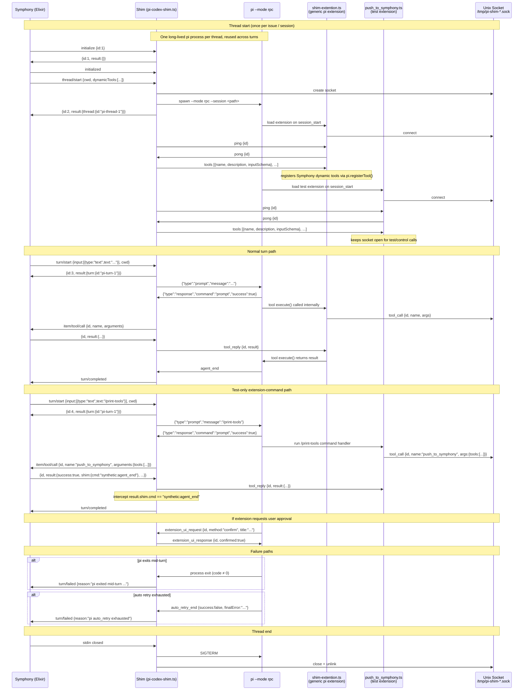

# pi-codex-shim Interaction Diagram

## Component Roles

| Component | Protocol | Lifetime |
|---|---|---|
| Symphony (Elixir) | Codex JSON-RPC over stdin/stdout | Process |
| Shim | Codex JSON-RPC ↔ pi RPC bridge | Process (= Symphony subprocess) |
| pi | pi RPC (stdin/stdout) | Thread (1 pi per issue) |
| Generic extension | pi extension API + socket client | = pi lifetime |
| Test extension | pi extension API + socket client | = pi lifetime |
| Unix socket | Custom NDJSON protocol | = pi lifetime |

## Message Legend

**Symphony → Shim** (Codex JSON-RPC):
- `initialize`, `initialized`, `thread/start`, `turn/start`
- `{id, result}` — replies to `item/tool/call`

**Shim → Symphony** (Codex JSON-RPC):
- `{id, result}` — ACKs to initialize / thread/start / turn/start
- `item/tool/call {id, name, arguments}` — dynamic tool dispatch
- `turn/completed` / `turn/failed`

**Shim → Pi** (pi RPC, stdin):
- `{"type":"prompt","message":"..."}` — one per turn
- `{"type":"extension_ui_response","id":"...","confirmed":true}` — auto-approval

**Pi → Shim** (pi RPC, stdout):
- `agent_end`, `turn_end`, `message_update`, `extension_ui_request`, `response`, ...

**Shim ↔ Extension** (Unix socket, NDJSON):
- `ping/pong` — handshake (shim initiates)
- `tools [...]` — dynamic tool specs (shim → extension, once per connection)
- `tool_call {id, name, args}` — extension → shim
- `tool_reply {id, result}` — shim → extension
